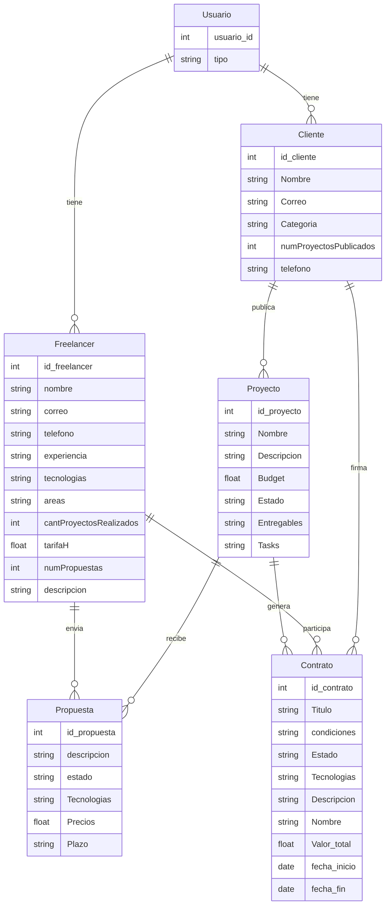
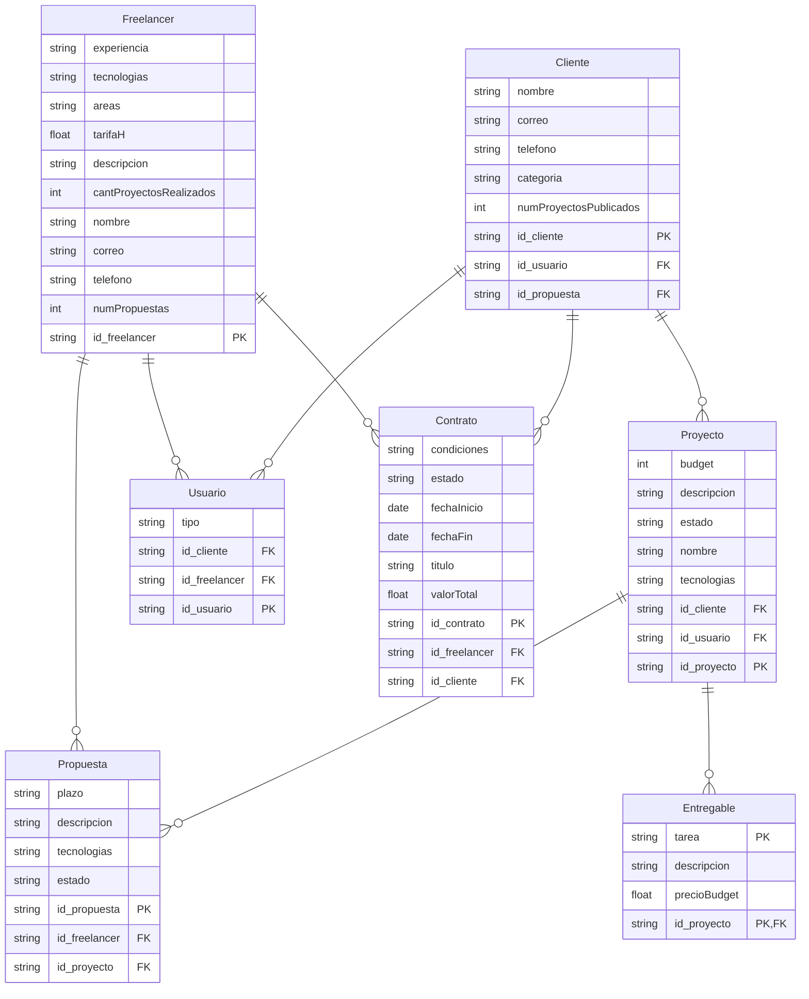
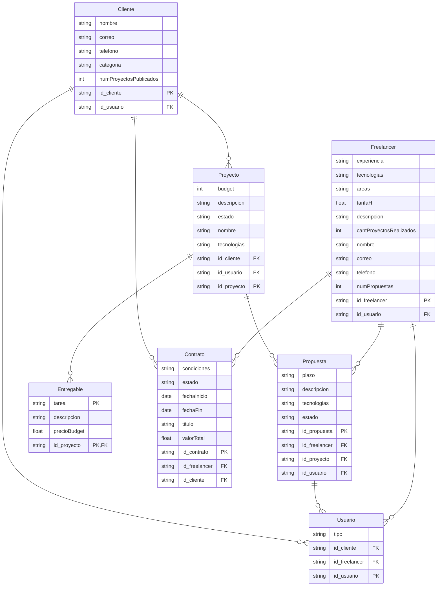
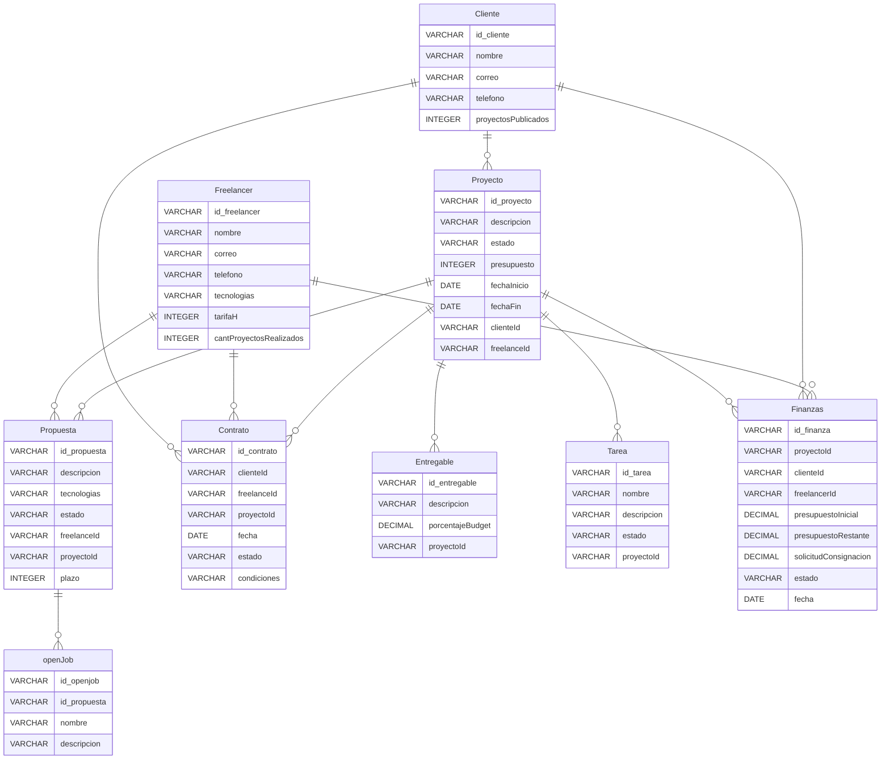

<h1 align="center">Freelance Project</h1>


<h3 align="center">

Juan  Fernando Umaña Barragan
<br>
Gerson Chapparro 
<br>


<br>
<br>


S1

<br>
<br>
<br>


PEDRO FELIPE GÓMEZ BONILLA

<br>
<br>
<br>


CAMPUSLANDS
<br>
<br>
<br>

Cajasan
<br>
<br>
<br>

RUTA Nodejs
<br>
<br>
<br>

Bucaramanga
<br>
<br>
<br>

2025

</h3>


---

<br>
<br>
<br>
<br>


## üìë Tabla de Contenidos
| Índice | Sección                                |
|--------|----------------------------------------|
| 1      | **Introducción**                       |
| 2      | **Caso de Estudio**                    |
| 3      | **Requerimientos entregados en el caso de estudio** |
| 4      | **Objetivos**                          |
| 5      | **Elementos del documento**            |
| 7      | **Planificación**                      |
| 8      | **Construcción del Modelo Conceptual** |
| 9      | **Descripción**                        |
| 11     | **Gr√°fica**                            |
| 12     | **Descripción Técnica**                |
| 13     | **Construcción del Modelo Lógico**     |
| 14     | **Descripción**                        |
| 16     | **Gr√°fica**                            |
| 17     | **Descripción Técnica**                |
| 18     | **Normalización del Modelo Lógico**    |
| 19     | **Primera Forma Normal (1FN)**         |
| 20     | **Descripción**                        |
| 21     | **Gr√°fica**                            |
| 22     | **Descripción Técnica**                |
| 23     | **Segunda Forma Normal (2FN)**         |
| 24     | **Descripción**                        |
| 25     | **Gr√°fica**                            |
| 26     | **Descripción Técnica**                |
| 27     | **Tercera Forma Normal (3FN)**         |
| 28     | **Descripción**                        |
| 29     | **Gr√°fica**                            |
| 30     | **Descripción Técnica**                |
| 31     | **Construcción del Modelo Físico**     |
| 32     | **Descripción**                        |
| 34     | **Código Documentado**                 |
| 35     | **Descripción Técnica**                |
| 36     | **Diagrama E-R**                       |
| 37     | **Descripción Técnica**                |
| 38     | **Referencias**                        |

---
<br>
<br>
<br>


# Introducción

El presente documento tiene como objetivo exponer de forma estructurada y detallada la solución a una problemática específica relacionada con el diseño e implementación de una base de datos organizada y eficiente, usando Mongodb como herramienta. Esta solución se desarrolla siguiendo una metodología que abarca todas las fases esenciales del proceso de organización y estructuración de datos, desde el análisis inicial hasta la construcción final del modelo físico.

La estructura del documento se organiza en distintas secciones que permiten abordar cada aspecto siguiendo el modelo entidad relación (e-r), el desarrollo del caso de estudio, objetivos, de manera clara y progresiva. En primer lugar, se presenta una introducción general al proyecto, estableciendo el contexto y el propósito de este. Posteriormente, se describe la situación que da origen al estudio, permitiendo comprender los requerimientos fundamentales del sistema a desarrollar.
A continuación, se lleva a cabo el diseño del modelo conceptual, que representa de forma abstracta las entidades involucradas, sus atributos y las relaciones entre ellas de manera inicial. Esta etapa es acompañada por representaciones gráficas y explicaciones técnicas que fundamentan las decisiones de modelado (modelo conceptual, modelo lógico y modelo físico).
Seguidamente, se construye el modelo lógico, el cual traduce el diseño conceptual en una estructura más concreta y alineada con los principios de los sistemas  bases de datos, en ese caso (NOSQL) . Este modelo se somete a un proceso de normalización, pasando por las tres formas normales (1FN, 2FN y 3FN), con el objetivo de optimizar la organización de los datos, eliminar redundancias y garantizar la integridad de los datos.
Finalmente, se desarrolla el modelo físico, que materializa el diseño lógico en instrucciones que se van a implementar en la base de datos de Mongodb. Este modelo incluye la  estructura de modelado de datos para bases de datos no relacionales . Todo esto es complementado con gráficas, fragmentos de código y descripciones técnicas que ilustran la funcionalidad del sistema.
En conjunto, este documento busca ofrecer una visión integral, lógica y comprensible del proceso de diseño y construcción de una base de datos, sirviendo como guía para la implementación de soluciones similares en este caso, para el caso de estudio de “Karen flix”.


<br>
<br>
<br>
<br>


# Caso de Estudio

- El proyecto consiste En la creación de una pagina web de peliculas utilizando fron-end y backend , junto con mongodb y bases de datos Nosql, ddonde existan dos perfiles, usuario y administraador, donde el primero  pueda, comentar acerca de las peiculas, brindarles una calificacion, ver las peliculas mas vistas , las mejor calificadas , que puedan visualizar su categoría, y que tengan un registro u inicio de sesion.

- El proyecto busca crear un sistema con un flujo eficiente que pueda limitar y permitir al usuario sus funciones basicas para ver información , escribir comentarios , entre otros, y , por otra parte permitir al administrador gestionar categorias y peliculas.


## **Funcionalidades requeridas**

1. **Gestión de usuarios**

   - Registro, inicio de sesión y autenticación mediante JWT.

   - Roles: usuario y administrador.

   - Los administradores pueden gestionar categorías y aprobar películas.

1. **Gestión de películas y series**

   - CRUD de películas/series (solo administradores aprueban nuevas entradas).

   - Validación para evitar títulos repetidos.

   - Atributos mínimos: título, descripción, categoría, año, imagen opcional.

1. **Gestión de reseñas y ratings**

   - Los usuarios pueden crear, editar y eliminar reseñas.

   - Cada reseña incluye: título, comentario, calificación numérica (1-10) -> (1-5) -> (1,1.1,1.2...5).

   - Los usuarios pueden dar **like/dislike** a reseñas de otros (no a las propias).

   - El sistema debe calcular un **ranking ponderado** de películas basado en calificaciones, likes/dislikes y fecha de reseña.

1. **Categorías**

   - CRUD de categorías (ejemplo: Anime, Ciencia Ficción, Superhéroes, Fantasía) (Min 4).

   - Solo administradores pueden gestionarlas.

1. **Ranking y listados**

   - Listado de películas con ordenamiento por **popularidad y ranking**.

   - Filtrado por categoría.

   - Vista de detalle con información y reseñas asociadas.


## **Especificaciones técnicas obligatorias**

1. **Backend (Node.js + Express)**

   - Uso obligatorio de dotenv, express, express-rate-limit, express-validator, mongodb, semver, swagger-ui-express, passport-jwt, jsonwebtoken, bcrypt.

   - MongoDB con operaciones transaccionales para garantizar consistencia.

   - Arquitectura modular y escalable.

   - Manejo de errores centralizado y códigos HTTP correctos.

   - Debe estar desarrollado en Node.js con Express.

   - Uso de variables de entorno para credenciales y configuración (archivo .env).

   - Modularización del código (separar rutas, controladores, modelos y configuración).

   - Validaciones en las rutas usando express-validator.

   - Manejo adecuado de errores y envío de respuestas con los códigos HTTP correctos.

   - Configuración de CORS para permitir la conexión desde el frontend.

     **Documentación en el README con: ** 

     - Explicación del proyecto.
     - Requerimientos de instalación.
     - Variables de entorno necesarias.
     - Ejemplos de endpoints y cómo probarlos.
     - Link al repositorio del frontend.

1. **Frontend**

   - HTML, CSS y JavaScript puro.

   - Pantallas mínimas: Inicio, Registro/Login, Listado de películas, Detalle de película, Panel admin.

   - Debe consumir los endpoints del backend.

   - Interfaz amigable y responsive para realizar todas las operaciones (crear, leer, actualizar, eliminar).

   - Mostrar mensajes de validación o error provenientes del backend.

   - Repositorio separado del backend.

1. **Documentación (README del backend)**

   - Descripción del proyecto y temática elegida.

   - Tecnologías usadas.

   - Pasos para instalar y ejecutar.

   - Ejemplos de endpoints y cómo consumirlos.

   - Link al repositorio del frontend.

1. **Video de entrega**

   - Duración máxima: **10 minutos**.

   - Deben aparecer todos los integrantes en c√°mara.

   - Mostrar brevemente el código del backend.

   - Mostrar el funcionamiento completo del frontend.


### Estructura del Sistema
  
  El sistema se encuentra dividido en las siguientes entidades principales:

- Usuario

- Calificacion

- Pelicula

- Reseña


<br>
<br>
<br>
<br>


# Objetivos 

Se planea desarrollar una api que contenga la logica del negocio desarrollada correctamente y la información necesaria para que pueda ser extraida correctamente del front-end, con 

#### 1.Realizar un buen planteamiento

#### 2. Establecer el modelo e-r para la base de datos 

#### 3.Cumplir con la normalizacion de la base de datos

#### 4. Finalizar la documentación de la base de datos

#### 5. Que la base de datos se pueda integrar correctamente al proyecto


<br>
<br>
<br>


<br>
<br>
<br>


<br>
<br>

# Planificación

## Diagrama E-R

### Descripción

Un diagrama ER (Entidad-Relación) es una herramienta visual que se utiliza en el diseño de bases de datos para representar de forma clara y estructurada los elementos clave del sistema de información. Este tipo de diagrama permite modelar los datos que serán almacenados, así como la forma en que se relacionan entre sí, antes de crear la base de datos. Ayuda a los analistas, diseñadores y desarrolladores a entender cómo se organiza la información, qué entidades intervienen, qué atributos poseen y cómo se conectan unas con otras.


## Construcción del Modelo Conceptual

Descripción
Un modelo conceptual en bases de datos es una representación, que describe las entidades, atributos y relaciones entre ellas en un negocio determinado, sin entrar en detalles de implementación tecnológica más específica. Su objetivo es comunicar la estructura de datos de manera clara y comprensible para los stakeholders, incluso aquellos sin conocimientos técnicos, y servir como base para el diseño lógico y físico de la base de datos.

Además, el modelo conceptual actúa como un puente entre los requerimientos del negocio y el diseño lógico y físico de la base de datos, sirviendo como punto de partida para construir modelos más detallados que ya consideren el tipo de base de datos a utilizar, la normalización y otros aspectos tecnológicos.

#### Descripción


### Descripción Técnica

Aqui se buscó el inicio del palanteamiento de la estructura que se busca en la plataforma de freelance, creando las entidades principales como: usuario, freelancer, cliente , proyecto, contrato, propuesta, etc, Con sus respectivos atributos 


## Grafica

``` mermaid
erDiagram
    Freelancer {
        int id_freelancer
        string nombre
        string correo
        string telefono
        string experiencia
        string tecnologias
        string areas
        int cantProyectosRealizados
        float tarifaH
        int numPropuestas
        string descripcion
    }

    Cliente {
        int id_cliente
        string Nombre
        string Correo
        string Categoria
        int numProyectosPublicados
        string telefono
    }

    Usuario {
        int usuario_id
        string tipo
    }

    Proyecto {
        int id_proyecto
        string Nombre
        string Descripcion
        float Budget
        string Estado
        string Entregables
        string Tasks
    }

    Propuesta {
        int id_propuesta
        string descripcion
        string estado
        string Tecnologias
        float Precios
        string Plazo
    }

    Contrato {
        int id_contrato
        string Titulo
        string condiciones
        string Estado
        string Tecnologias
        string Descripcion
        string Nombre
        float Valor_total
        date fecha_inicio
        date fecha_fin
    }

    %% Relaciones
    Usuario ||--o{ Cliente : tiene
    Usuario ||--o{ Freelancer : tiene

    Cliente ||--o{ Proyecto : publica
    Freelancer ||--o{ Propuesta : envia
    Proyecto ||--o{ Propuesta : recibe
    Proyecto ||--o{ Contrato : genera
    Freelancer ||--o{ Contrato : participa
    Cliente ||--o{ Contrato : firma

```


## Construcción del Modelo Logico


### Descripción
Un modelo lógico de base de datos es una representación más detallada y estructurada del modelo conceptual, en la que se definen de manera precisa las entidades, sus atributos, y las relaciones entre ellas, así como aspectos técnicos como los identificadores únicos , para este modelo con MongoDB no se usaron llaves primareas o foraneas, se hizo referencia a esto mediante ids repetidos de referencia a llaves entre colecciones. A diferencia del modelo conceptual, el modelo lógico ya toma en cuenta cómo los datos serán organizados y estructurados dentro de un sistema de gestión de bases de datos.

Finalmente, hay que tener en cuenta que para realizar el modelo lógico, se necesita la siguiente estructura, En la cuál desaparecen los verbos, las entidades se vuelven tablas y los atributos, columnas


# Descripción Técnica

Aqui se realizó lo ya establecido en el modelo conceptual inicial, sin embargo se empezaron a utilizar ids o foreign keys ( las cuales en este caso son referencias en mongodb) para conectar los datos y se empezaron a realizar relaciones ya sea de uno a uno, uno a muchos o muchos a muchos para luego poder realizar la respectima normalización y estructuración completa de los datos.


## Entidades Antes de la normalización

### Freelancer

- id_freelancer

- nombre

- correo

- telefono

- experiencia

- tecnologias

- areas

- antProyectosRealizados

- tarifaH

- numPropuestas

- descripcion

### Cliente

- id_cliente

- Nombre

- Correo

- Categoria

- numProyectosPublicados

- telefono

- Usuario

- usuario_id

- tipo

### Proyecto

- id_proyecto

- Nombre

- Descripcion

- Budget

- Estado

- Entregables

- Tasks

### Propuesta

- id_propuesta

- descripcion

- estado

- Tecnologias

- Precios

- Plazo

### Contrato

- id_contrato

- Titulo

- condiciones

- Estado

- Tecnologias

- Descripcion

- Nombre

- Valor total

- fecha inicio

- fecha fin

# Normalización del Modelo Lógico

<br>
<br>


# Primera Forma Normal (1FN)
### Descripción

La Primera Forma Normal (1FN) es el proceso de normalización de bases de datos, el cual, establece que todos los atributos de una tabla deben ser atómicos, es decir, deben contener valores únicos que no se pueden repetir, evitando que existan atributos multivaluados dentro de una sola entidad. Cuando se detecta que un atributo contiene múltiples valores, se debe reorganizar la estructura de la base de datos para cumplir con la 1FN. En estos casos, la solución consiste en separar el atributo multivaluado y colocarlo en una nueva tabla, estableciendo una relación adecuada entre distintas tablas.

# Gr√°fica


``` mermaid
erDiagram
    Proyecto {
        int budget
        string descripcion
        string estado
        string nombre
        string tecnologias
        string id_cliente FK
        string id_usuario FK
        string id_proyecto PK
    }

    Cliente {
        string nombre
        string correo
        string telefono
        string categoria
        int numProyectosPublicados
        string id_cliente PK
        string id_usuario FK
        string id_propuesta FK
    }

    Propuesta {
        string plazo
        string descripcion
        string tecnologias
        string estado
        string id_propuesta PK
        string id_freelancer FK
        string id_proyecto FK
    }

    Entregable {
        string tarea PK
        string descripcion
        float precioBudget
        string id_proyecto PK, FK
    }

    Usuario {
        string tipo
        string id_cliente FK
        string id_freelancer FK
        string id_usuario PK
    }

    Contrato {
        string condiciones
        string estado
        date fechaInicio
        date fechaFin
        string titulo
        float valorTotal
        string id_contrato PK
        string id_freelancer FK
        string id_cliente FK
    }

    Freelancer {
        string experiencia
        string tecnologias
        string areas
        float tarifaH
        string descripcion
        int cantProyectosRealizados
        string nombre
        string correo
        string telefono
        int numPropuestas
        string id_freelancer PK
    }

    Cliente ||--o{ Proyecto : ""
    Cliente ||--o{ Contrato : ""
    Cliente ||--o{ Usuario : ""
    Proyecto ||--o{ Propuesta : ""
    Proyecto ||--o{ Entregable : ""
    Freelancer ||--o{ Propuesta : ""
    Freelancer ||--o{ Contrato : ""
    Freelancer ||--o{ Usuario : ""


``` 

### Descripción Técnica

Para cumplir con la primera forma de normalización se eliminaron repeticiones de datos (campos multivaluados o anidados) para que todo sea atómico.

#### Cambios hechos:

- Se añadieron nuevos atributos como plazo a proyectos


- Se cambiaron algunos atributos multivaluados

- Entregables se uelve unsa tabla y tareas uno de sus atributos

- se hace el esquema e referencias con llaves for√°neas , sin  embargo en mongodb fiunciona diferente


<br>
<br>
<br>


# Segundo Forma Normal (2FN)
### Descripción

En bases de datos relacionales es un paso en el proceso de normalización que busca eliminar las dependencias parciales. Esto significa que, además de cumplir con los requisitos de la primera forma normal (1NF), las columnas no clave deben depender de la clave primaria completa y no solo de parte de ella.


### Gafica

``` mermaid
erDiagram
    Proyecto {
        int budget
        string descripcion
        string estado
        string nombre
        string tecnologias
        string id_cliente FK
        string id_usuario FK
        string id_proyecto PK
    }

    Cliente {
        string nombre
        string correo
        string telefono
        string categoria
        int numProyectosPublicados
        string id_cliente PK
        string id_usuario FK
    }

    Propuesta {
        string plazo
        string descripcion
        string tecnologias
        string estado
        string id_propuesta PK
        string id_freelancer FK
        string id_proyecto FK
        string id_usuario FK
    }

    Entregable {
        string tarea PK
        string descripcion
        float precioBudget
        string id_proyecto PK, FK
    }

    Usuario {
        string tipo
        string id_cliente FK
        string id_freelancer FK
        string id_usuario PK
    }

    Contrato {
        string condiciones
        string estado
        date fechaInicio
        date fechaFin
        string titulo
        float valorTotal
        string id_contrato PK
        string id_freelancer FK
        string id_cliente FK
    }

    Freelancer {
        string experiencia
        string tecnologias
        string areas
        float tarifaH
        string descripcion
        int cantProyectosRealizados
        string nombre
        string correo
        string telefono
        int numPropuestas
        string id_freelancer PK
        string id_usuario FK
    }

    Cliente ||--o{ Proyecto : ""
    Cliente ||--o{ Contrato : ""
    Cliente ||--o{ Usuario : ""
    Proyecto ||--o{ Propuesta : ""
    Proyecto ||--o{ Entregable : ""
    Propuesta ||--o{ Usuario : ""
    Freelancer ||--o{ Propuesta : ""
    Freelancer ||--o{ Contrato : ""
    Freelancer ||--o{ Usuario : ""
``` 


### Descripción Técnica
Para cumplir con la segunda forma de normalización se eliminaron dependencias parciales: que ningún campo dependa solo de parte de una clave compuesta.


#### Cambios hechos:

- Se creó una tabla llamada open job , que ayuda a manejar la dependencia de los atributos de propuesta con el freelancer, y conectarlo a travz del opne job publicado con el cliente. 


# Tercera Forma Normal (3FN)
### Descripción
La Tercera Forma Normal (3FN) es una forma normal en la normalización de bases de datos. Su objetivo principal es eliminar las dependencias transitivas, quiere decir que crea dependencia entre tablas lejanas y las tablas principales.

Cuando se evidencia que m√∫ltiples tablas tienen una gran dependencia, una de la otra, se busca eliminarla, integrando nuevas tablas que vuelvan a los datos a√∫n m√°s independientes.


### Descripción Técnica
Con esta forma de normalización se buscó, Eliminar dependencias transitivas: que ningún campo no clave dependa de otro campo no clave.


### Grafica


``` mermaid
erDiagram
    Cliente {
        VARCHAR id_cliente
        VARCHAR nombre
        VARCHAR correo
        VARCHAR telefono
        INTEGER proyectosPublicados
    }

    Freelancer {
        VARCHAR id_freelancer
        VARCHAR nombre
        VARCHAR correo
        VARCHAR telefono
        VARCHAR tecnologias
        INTEGER tarifaH
        INTEGER cantProyectosRealizados
    }

    Proyecto {
        VARCHAR id_proyecto
        VARCHAR descripcion
        VARCHAR estado
        INTEGER presupuesto
        DATE fechaInicio
        DATE fechaFin
        VARCHAR clienteId
        VARCHAR freelanceId
    }

    Propuesta {
        VARCHAR id_propuesta
        VARCHAR descripcion
        VARCHAR tecnologias
        VARCHAR estado
        VARCHAR freelanceId
        VARCHAR proyectoId
        INTEGER plazo
    }

    Contrato {
        VARCHAR id_contrato
        VARCHAR clienteId
        VARCHAR freelanceId
        VARCHAR proyectoId
        DATE fecha
        VARCHAR estado
        VARCHAR condiciones
    }

    Entregable {
        VARCHAR id_entregable
        VARCHAR descripcion
        DECIMAL porcentajeBudget
        VARCHAR proyectoId
    }

    Tarea {
        VARCHAR id_tarea
        VARCHAR nombre
        VARCHAR descripcion
        VARCHAR estado
        VARCHAR proyectoId
    }

    openJob {
        VARCHAR id_openjob
        VARCHAR id_propuesta
        VARCHAR nombre
        VARCHAR descripcion
    }

    Finanzas {
        VARCHAR id_finanza
        VARCHAR proyectoId
        VARCHAR clienteId
        VARCHAR freelancerId
        DECIMAL presupuestoInicial
        DECIMAL presupuestoRestante
        DECIMAL solicitudConsignacion
        VARCHAR estado
        DATE fecha
    }

    %% Relaciones
    Cliente ||--o{ Proyecto : ""
    Freelancer ||--o{ Propuesta : ""
    Proyecto ||--o{ Propuesta : ""
    Cliente ||--o{ Contrato : ""
    Freelancer ||--o{ Contrato : ""
    Proyecto ||--o{ Contrato : ""
    Proyecto ||--o{ Entregable : ""
    Proyecto ||--o{ Tarea : ""
    Propuesta ||--o{ openJob : ""
    Proyecto ||--o{ Finanzas : ""
    Cliente ||--o{ Finanzas : ""
    Freelancer ||--o{ Finanzas : ""


``` 


#### Cambios hechos:

- Tareas se convirtió e una tabla y ya no pertenece a entregables relacionndo entregables con las tareas

- Se añadió la tabla finanzas, para poder gestionar las transacciones y finanzas del proyecto


# Construcción del Modelo Físico


### Descripción

El modelo físico en una base de datos es una representación detallada de cómo se implementará la estructura de la base de datos en el hardware y software, incluyendo las colecciones, inserciones, funciones, usuarios y consultas.

Finalmente, hay que tener en cuenta que para desarrollar el modelo físico, se deben realizar funciones, usuarios json schema, inserciones de datos y consultas dentro de MongoDB ( En este caso con Atlas) y en base a esto ejecutar comandos con los datos que se vana a incluir , de la siguiente manera:


## Codigo para las inserciones

``` js

// ===================== 🔫 ACCIÓN =====================
db.peliculas.insertMany([
  {
    Title: "Duro de matar",
    Year: "1988",
    Released: "20 Jul 1988",
    Runtime: "132 min",
    Genre: "Accion",
    Poster: "https://m.media-amazon.com/images/M/MV5BMjI3.jpg",
    Plot: "Un policía intenta rescatar a rehenes de un rascacielos tomado por terroristas."
  },
  {
    Title: "Mad Max: Furia en el camino",
    Year: "2015",
    Released: "15 May 2015",
    Runtime: "120 min",
    Genre: "Accion",
    Poster: "https://m.media-amazon.com/images/M/MV5BMjA3.jpg",
    Plot: "En un futuro desértico, Max y Furiosa luchan por sobrevivir contra un tirano."
  },
  {
    Title: "Misión: Imposible",
    Year: "1996",
    Released: "22 May 1996",
    Runtime: "110 min",
    Genre: "Accion",
    Poster: "https://m.media-amazon.com/images/M/MV5BMzQw.jpg",
    Plot: "Un agente secreto es incriminado por la muerte de su equipo y debe limpiar su nombre."
  },
  {
    Title: "Gladiador",
    Year: "2000",
    Released: "05 May 2000",
    Runtime: "155 min",
    Genre: "Accion",
    Poster: "https://m.media-amazon.com/images/M/MV5BMTAx.jpg",
    Plot: "Un general romano busca vengar la muerte de su familia enfrent√°ndose al corrupto emperador."
  },
  {
    Title: "John Wick",
    Year: "2014",
    Released: "24 Oct 2014",
    Runtime: "101 min",
    Genre: "Accion",
    Poster: "https://m.media-amazon.com/images/M/MV5BMTk0.jpg",
    Plot: "Un exasesino a sueldo regresa al mundo del crimen para vengar la muerte de su perro."
  },
  {
    Title: "Terminator 2: El juicio final",
    Year: "1991",
    Released: "03 Jul 1991",
    Runtime: "137 min",
    Genre: "Accion",
    Poster: "https://m.media-amazon.com/images/M/MV5BMjA2.jpg",
    Plot: "Un cyborg debe proteger a un niño destinado a liderar la resistencia contra las máquinas."
  },
  {
    Title: "Los Vengadores",
    Year: "2012",
    Released: "04 May 2012",
    Runtime: "143 min",
    Genre: "Accion",
    Poster: "https://m.media-amazon.com/images/M/MV5BMjI0.jpg",
    Plot: "Los superhéroes más poderosos de la Tierra deben unirse para detener una invasión alienígena."
  },
  {
    Title: "The Dark Knight",
    Year: "2008",
    Released: "18 Jul 2008",
    Runtime: "152 min",
    Genre: "Accion",
    Poster: "https://m.media-amazon.com/images/M/MV5BMTMx.jpg",
    Plot: "Batman enfrenta al Joker, un criminal que busca sumir a Ciudad Gótica en el caos."
  },
  {
    Title: "R√°pidos y furiosos",
    Year: "2001",
    Released: "22 Jun 2001",
    Runtime: "106 min",
    Genre: "Accion",
    Poster: "https://m.media-amazon.com/images/M/MV5BMjEx.jpg",
    Plot: "Un policía se infiltra en el mundo de las carreras ilegales y se enfrenta a la lealtad y la justicia."
  },
  {
    Title: "Matrix",
    Year: "1999",
    Released: "31 Mar 1999",
    Runtime: "136 min",
    Genre: "Accion",
    Poster: "https://m.media-amazon.com/images/M/MV5BMjA3.jpg",
    Plot: "Un programador descubre que el mundo que conoce es una simulación creada por máquinas."
  },
  {
    Title: "300",
    Year: "2006",
    Released: "09 Mar 2007",
    Runtime: "117 min",
    Genre: "Accion",
    Poster: "https://m.media-amazon.com/images/M/MV5BMjA1.jpg",
    Plot: "El rey Leónidas lidera a 300 espartanos en la batalla contra el ejército persa."
  },
  {
    Title: "Misión: Imposible - Repercusión",
    Year: "2018",
    Released: "27 Jul 2018",
    Runtime: "147 min",
    Genre: "Accion",
    Poster: "https://m.media-amazon.com/images/M/MV5BMjM5.jpg",
    Plot: "Ethan Hunt y su equipo enfrentan las consecuencias de una misión fallida."
  },
  {
    Title: "Kill Bill: Volumen 1",
    Year: "2003",
    Released: "10 Oct 2003",
    Runtime: "111 min",
    Genre: "Accion",
    Poster: "https://m.media-amazon.com/images/M/MV5BMjYx.jpg",
    Plot: "Una asesina busca venganza contra su antiguo equipo que intentó matarla."
  },
  {
    Title: "Black Panther",
    Year: "2018",
    Released: "16 Feb 2018",
    Runtime: "134 min",
    Genre: "Accion",
    Poster: "https://m.media-amazon.com/images/M/MV5BMjU4.jpg",
    Plot: "El príncipe T'Challa regresa a Wakanda para reclamar el trono y defender a su nación."
  },
  {
    Title: "Misión Rescate",
    Year: "2020",
    Released: "24 Apr 2020",
    Runtime: "116 min",
    Genre: "Accion",
    Poster: "https://m.media-amazon.com/images/M/MV5BMjQw.jpg",
    Plot: "Un mercenario debe rescatar al hijo secuestrado de un capo internacional."
  },
  {
    Title: "Casino Royale",
    Year: "2006",
    Released: "17 Nov 2006",
    Runtime: "144 min",
    Genre: "Accion",
    Poster: "https://m.media-amazon.com/images/M/MV5BMjIz.jpg",
    Plot: "James Bond participa en un juego de póker de alto riesgo para detener a un financista del terrorismo."
  },
  {
    Title: "Iron Man",
    Year: "2008",
    Released: "02 May 2008",
    Runtime: "126 min",
    Genre: "Accion",
    Poster: "https://m.media-amazon.com/images/M/MV5BMjAx.jpg",
    Plot: "Un magnate de armas construye una armadura para convertirse en superhéroe."
  },
  {
    Title: "Capitán América: El Soldado de Invierno",
    Year: "2014",
    Released: "04 Apr 2014",
    Runtime: "136 min",
    Genre: "Accion",
    Poster: "https://m.media-amazon.com/images/M/MV5BMjQ2.jpg",
    Plot: "El Capitán América enfrenta a un nuevo enemigo conocido como el Soldado de Invierno."
  },
  {
    Title: "Mortal Kombat",
    Year: "2021",
    Released: "23 Apr 2021",
    Runtime: "110 min",
    Genre: "Accion",
    Poster: "https://m.media-amazon.com/images/M/MV5BMjM4.jpg",
    Plot: "Un grupo de luchadores es elegido para defender la Tierra en un torneo mortal."
  }
]);


``` 


## Descripción Técnica

Para realizar el modelo físico, se tuvieron en cuenta los datos de la base de datos normalizada hasta la tercera forma normal

# Referencias


